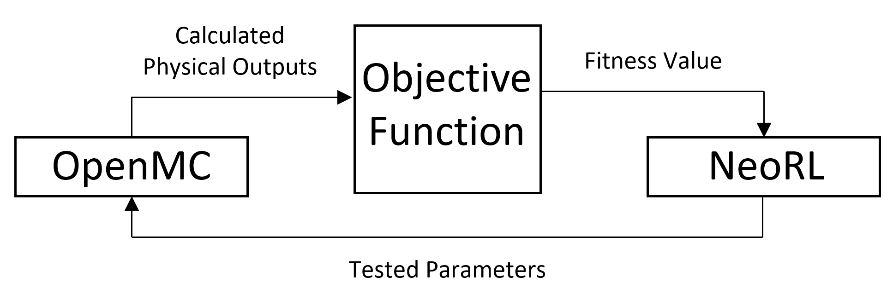

# RLOpenNeoMC
Reactor Optimization Benchmark by Reinforced Learning
OpenMC is a community-developed Monte Carlo neutron and photon transport simulation code.
This Benchmark within the OpenNeoMC framework is designed specifically for reinforcement learning.
The benchmark involves a unit cell of a research reactor with two varying parameters; the fuel and water density.
The goal is to  maximize neutron flux while maintaining a reactor criticality of one.
Minimizing the fitness function wil fulfill these both requirement.
The fitness landscape is not trivial,their is a local minimum and a deep and steep global minimum at the edge of the parameter domain.
Therefore, reinforce algorithm are more adapted in this case.
 

 
# Instructions
## Requirments
First, clone the RLOpenNeoMC code provided here.
```
clone https://github.com/Scientific-Computing-Lab-NRCN/RLOpenNeoMC.git
```
Then, create a conda environment:
```
conda create --name openneomc python=3.7
```
Activate the new environment and install neorl:
```
activate openneomc
pip install neorl
```
Then, install OpenMC using this [OpenMC installation](https://docs.openmc.org/en/v0.13.1/quickinstall.html#installing-from-source-on-linux-or-mac-os-x)

## Citation
For more information about the measures and their means of the implementations, please refer to the paper.
If you found these codes useful for your research, please consider citing: 

## Running
### Configuration
#### Set Cross-Sections
The simulation of OpenMC requires cross-sections files to run properly. We demonstrate in this paper a method for saving simulation runtime by moving these files to the RAM memory (tmp folder). This process is done by running the following code:
```
python copy_to_ram.py [path]
```
Note: you have to specify the correct path to endfb-vii.1-hdf5 files instead of [path]

#### Training Algorithms
There are several parameters for training JAYA and PPO-ES for our suggested benchmark in the main.py file.
```
opt_algorithm = 'JAYA'
ncores = 1 
verbose = True
os.environ['OPENMC_CROSS_SECTIONS'] = '/tmp/endfb-vii.1-hdf5/cross_sections.xml'
```
* opt_algorithm - gets 'JAYA' or 'PPO-ES' correspondingly.
* ncores - sets the number of parallel proccesses (note that we ran JAYA with 4 cores and PPO-ES with 1).
* verbose - responsible for the amount of output information through the running.
* os.environ['OPENMC_CROSS_SECTIONS'] - make sure that  gets the correct tmp directory.

Finally, after these parameters are set. Run the training by the following command: 
```
python main.py
```
To plot the best fit in each iteration make sure to set the correct results paths in read_and_plot_fitness_PPOES_JAYA.py and run:
```
python read_and_plot_fitness_PPOES_JAYA.py
```
## Results
'last_pop':            var1       var2   fitness
indv1  2.895537  24.910865  1.001707
indv2  2.918418  24.836727  1.001500
indv3  2.925460  24.995064  0.998605
indv4  2.950633  25.027720  1.000753}
running time:
 3429.971603155136
